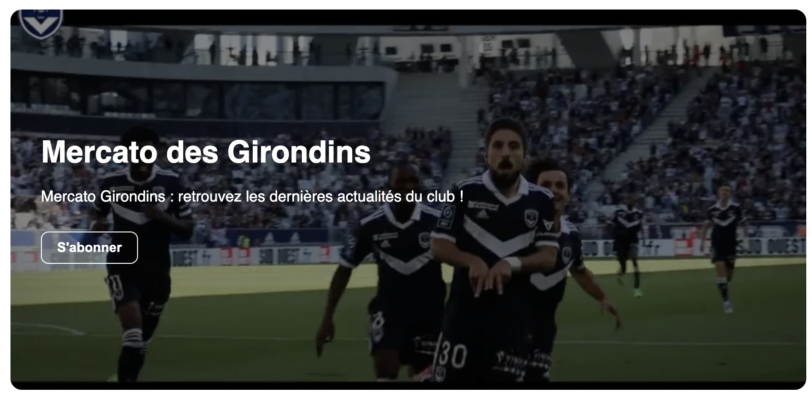
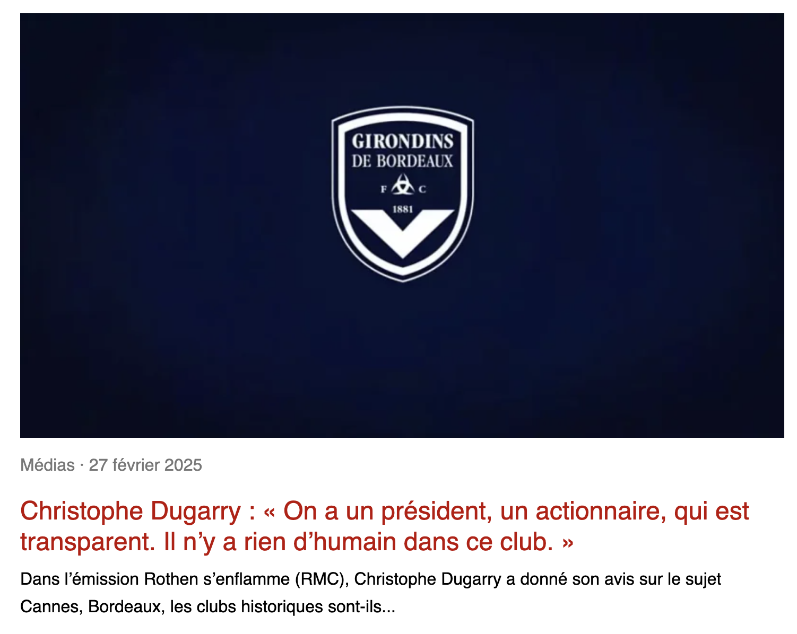

# G33 Design System

Design System built with StencilJS and TypeScript.

## Objectives

- Discover Stencil and Web Components
- Build a reusable component library
- Use CSS Design Tokens
- Integrate a Headless CMS (Storyblok)
- Apply accessibility best practices

## Overview




## Technical Stack

- StencilJS
- TypeScript
- Web Components
- Shadow DOM
- Storyblok
- CSS Variables (Design Tokens)

## Available Components

### g33-button

Reusable button component with multiple variants:

- Primary
- Secondary
- Ghost

### g33-alert

Contextual alerts:

- Success
- Warning
- Error

### g33-article-card

Article card component featuring:

- image
- category
- publication date
- title
- excerpt
- optional CTA

### g33-hero-banner

Hero Banner component configurable through Storyblok:

- title
- subtitle
- image
- CTA label
- CTA URL
- target (\_self / \_blank)

## Design Tokens

The Design System relies on CSS Design Tokens for:

- colors
- spacing
- typography
- border radius
- shadows

Example:

```css
--g33-color-primary
--g33-spacing-md
--g33-radius-lg
```

## Accessibility

Implemented accessibility best practices:

- image alt attributes
- semantic `<time datetime>`
- `:focus-visible` states
- contextual `aria-label`
- heading hierarchy

## Storyblok Integration

Storyblok is used as a Headless CMS.

Data flow:

```text
Storyblok
    ↓
JSON API
    ↓
Stencil Components
    ↓
Web Components
```

The Hero Banner retrieves:

- title
- subtitle
- image
- CTA label
- CTA URL
- target
- image alt text

## React Consumer Application

A React application demonstrating the integration of the Design System components with Storyblok and the WordPress REST API.

🔗 [Repository](https://github.com/juliencap/g33-react-consumer)

🌐 [Live Demo](https://g33-react-consumer.vercel.app/)

## Installation

```bash
npm install
```

## Development

```bash
npm start
```

## Build

```bash
npm run build
```

## Author

Julien Cap
