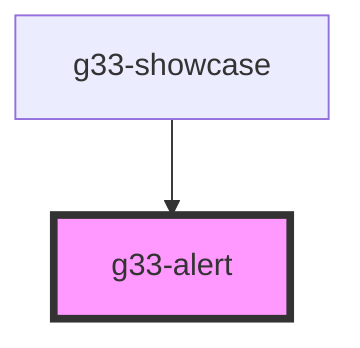

# g33-alert

<!-- Auto Generated Below -->

## Properties

| Property | Attribute | Description | Type                                          | Default  |
| -------- | --------- | ----------- | --------------------------------------------- | -------- |
| `type`   | `type`    |             | `"error" \| "info" \| "success" \| "warning"` | `'info'` |

## Dependencies

### Used by

 - [g33-showcase](../g33-showcase)

### Graph

----------------------------------------------

*Built with [StencilJS](https://stenciljs.com/)*
