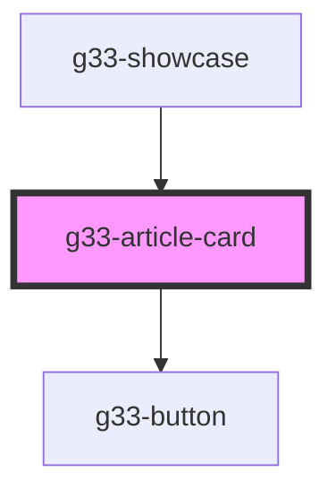

# g33-article-card

<!-- Auto Generated Below -->

## Properties

| Property                   | Attribute             | Description | Type     | Default     |
| -------------------------- | --------------------- | ----------- | -------- | ----------- |
| `author`                   | `author`              |             | `string` | `undefined` |
| `category` _(required)_    | `category`            |             | `string` | `undefined` |
| `excerpt`                  | `excerpt`             |             | `string` | `undefined` |
| `imageUrl` _(required)_    | `image-url`           |             | `string` | `undefined` |
| `postTitle` _(required)_   | `post-title`          |             | `string` | `undefined` |
| `postUrl`                  | `post-url`            |             | `string` | `'#'`       |
| `publishedAt` _(required)_ | `published-at`        |             | `string` | `undefined` |
| `publishedDateTime`        | `published-date-time` |             | `string` | `undefined` |

## Dependencies

### Used by

 - [g33-showcase](../g33-showcase)

### Depends on

- [g33-button](../g33-button)

### Graph

----------------------------------------------

*Built with [StencilJS](https://stenciljs.com/)*
