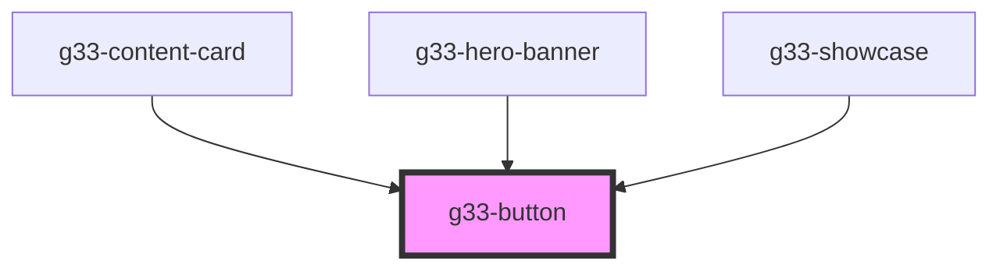

# g33-button

<!-- Auto Generated Below -->

## Properties

| Property   | Attribute  | Description | Type                                  | Default     |
| ---------- | ---------- | ----------- | ------------------------------------- | ----------- |
| `disabled` | `disabled` |             | `boolean`                             | `false`     |
| `size`     | `size`     |             | `"lg" \| "md" \| "sm"`                | `'md'`      |
| `variant`  | `variant`  |             | `"ghost" \| "primary" \| "secondary"` | `'primary'` |

## Dependencies

### Used by

 - [g33-content-card](../g33-content-card)
 - [g33-hero-banner](../g33-hero-banner)
 - [g33-showcase](../g33-showcase)

### Graph

----------------------------------------------

*Built with [StencilJS](https://stenciljs.com/)*
