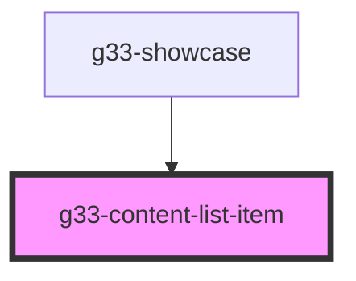

# g33-content-list-item

<!-- Auto Generated Below -->

## Properties

| Property            | Attribute             | Description | Type     | Default     |
| ------------------- | --------------------- | ----------- | -------- | ----------- |
| `category`          | `category`            |             | `string` | `undefined` |
| `contentTitle`      | `content-title`       |             | `string` | `undefined` |
| `contentUrl`        | `content-url`         |             | `string` | `undefined` |
| `displayDate`       | `display-date`        |             | `string` | `undefined` |
| `publishedDateTime` | `published-date-time` |             | `string` | `undefined` |

## Dependencies

### Used by

 - [g33-showcase](../g33-showcase)

### Graph

----------------------------------------------

*Built with [StencilJS](https://stenciljs.com/)*
