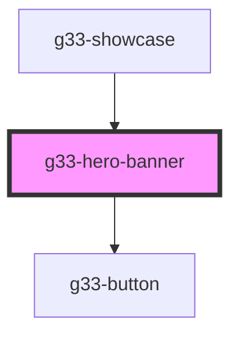

# g33-hero-banner

<!-- Auto Generated Below -->

## Properties

| Property                 | Attribute    | Description | Type     | Default     |
| ------------------------ | ------------ | ----------- | -------- | ----------- |
| `ctaLabel`               | `cta-label`  |             | `string` | `undefined` |
| `ctaTarget`              | `cta-target` |             | `string` | `undefined` |
| `ctaUrl`                 | `cta-url`    |             | `string` | `undefined` |
| `imageAlt`               | `image-alt`  |             | `string` | `undefined` |
| `imageUrl`               | `image-url`  |             | `string` | `undefined` |
| `subtitle`               | `subtitle`   |             | `string` | `undefined` |
| `titleText` _(required)_ | `title-text` |             | `string` | `undefined` |

## Dependencies

### Used by

 - [g33-showcase](../g33-showcase)

### Depends on

- [g33-button](../g33-button)

### Graph

----------------------------------------------

*Built with [StencilJS](https://stenciljs.com/)*
